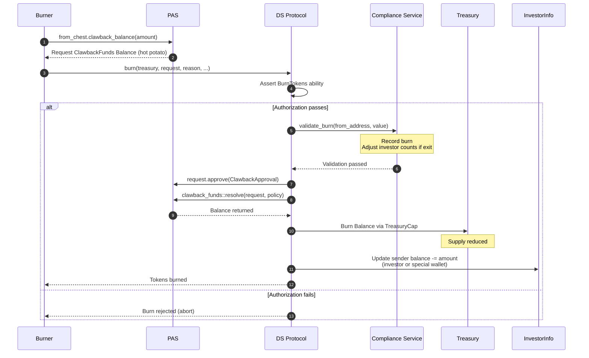

# Burn Flow

## Overview

The burn flow destroys tokens from a wallet, reducing total supply. It uses a PAS `Request<ClawbackFunds<Balance<T>>>` that is created externally, then approved and resolved **internally** within `ds_token::burn`.

Enforced via capability-based authorization (`BurnTokens` ability).

## Function Signature

```move
public fun burn<T>(
    treasury: &mut Treasury<T>,
    auth: &Auth<T>,
    investors: &mut InvestorInfo<T>,
    policy: &Policy<Balance<T>>,
    mut request: Request<ClawbackFunds<Balance<T>>>,
    reason: String,
    version: &Version,
    ctx: &mut TxContext,
)
```

## PAS Request/Approval Pattern

1. **Create** - `from_chest.clawback_balance(amount, ctx)` withdraws `Balance<T>` from the target chest and wraps it into a `Request<ClawbackFunds<Balance<T>>>` with an empty approvals set. No `Auth` proof required (admin action).
2. **Approve** - Inside `ds_token::burn`, the request is stamped: `request.approve(ClawbackApproval<T>())`.
3. **Resolve** - Also inside `ds_token::burn`, the request is resolved: `clawback_funds::resolve(request, policy)` verifies the collected approvals match the `Policy<Balance<T>>` requirements and returns the `Balance<T>`, which is then burned via `TreasuryCap`.

## Execution Steps

1. **Version check** - `version.check_is_valid()`
2. **Extract request data** - owner address and amount from `request.data()`
3. **Authorization check** - caller must have `BurnTokens` ability (roles: `Master`, `Issuer`, `TransferAgent`)
4. **Compliance validation** - `compliance_service::validate_burn(investors, from_address, value)` (see below)
5. **Approve request** - `request.approve(ClawbackApproval<T>())`
6. **Resolve request** - `clawback_funds::resolve(request, policy)` returns `Balance<T>`
7. **Burn tokens** - Balance is converted to `Coin<T>` and burned via `TreasuryCap<T>` (stored as dynamic object field on Treasury). Total supply is reduced.
8. **Update balances**:
   - **Regular investor wallet**: subtracts `value` from investor total balance and per-wallet balance
   - **Special wallet**: subtracts `value` from special wallet balance
9. **Emit events** - `Burn<T>` and `Transfer<T>` (to `@0x0`)

## Compliance Validation (`validate_burn`)

Burn has minimal compliance checks:
- Resolves `PartyInfo` for the source address
- If the burn causes the investor to exit (`total_balance == amount`), decrements total investor counts (and adjusts country/accreditation breakdowns)
- Emits `DSComplianceBurnRecorded<T> { from, amount }`

No dynamic compliance rules are checked for burn.

## Events

| Event | Fields |
|---|---|
| `DSComplianceBurnRecorded<T>` | `from`, `amount` |
| `Burn<T>` | `burner`, `value`, `reason` |
| `Transfer<T>` | `from`, `to: @0x0`, `value` |

## Full PTB Call Sequence

```
1. from_chest.clawback_balance(amount, ctx)
      -> Request<ClawbackFunds<Balance<T>>>

2. ds_token::burn(treasury, auth, investors, policy, request, reason, version, ctx)
      -> compliance check + approve + resolve + burn Balance<T> + balance updates
```

## Sequence Diagram


