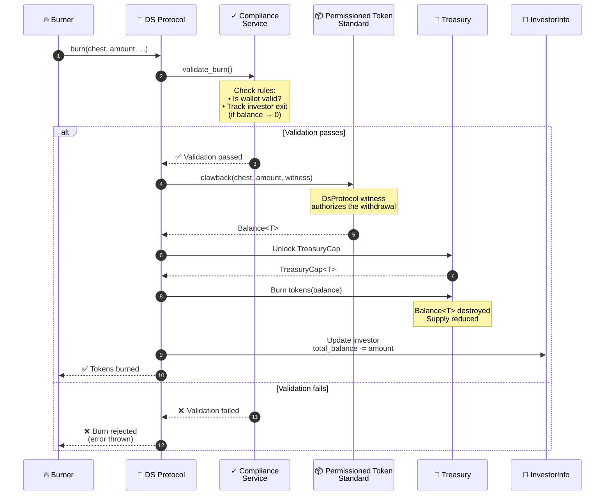

# Burn Tokens Sequence Diagram

```mermaid
sequenceDiagram
    autonumber
    participant Burner as 🔥 Burner
    participant DS as 🔷 DS Protocol
    participant Compliance as ✓ Compliance<br/>Service
    participant PTS as 📦 Permissioned Token<br/>Standard
    participant Treasury as 🏦 Treasury
    participant Registry as 👥 InvestorInfo

    Burner->>DS: burn(chest, amount, ...)

    DS->>Compliance: validate_burn()

    Note over Compliance: Check rules:<br/>• Is wallet valid?<br/>• Track investor exit<br/>(if balance → 0)

    alt Validation passes
        Compliance-->>DS: ✅ Validation passed

        DS->>PTS: clawback(chest, amount, witness)
        Note over PTS: DsProtocol witness<br/>authorizes the withdrawal
        PTS-->>DS: Balance<T>

        DS->>Treasury: Unlock TreasuryCap
        Treasury-->>DS: TreasuryCap<T>

        DS->>Treasury: Burn tokens(balance)
        Note over Treasury: Balance<T> destroyed<br/>Supply reduced

        DS->>Registry: Update investor<br/>total_balance -= amount

        DS-->>Burner: ✅ Tokens burned
    else Validation fails
        Compliance-->>DS: ❌ Validation failed
        DS-->>Burner: ❌ Burn rejected<br/>(error thrown)
    end
```
