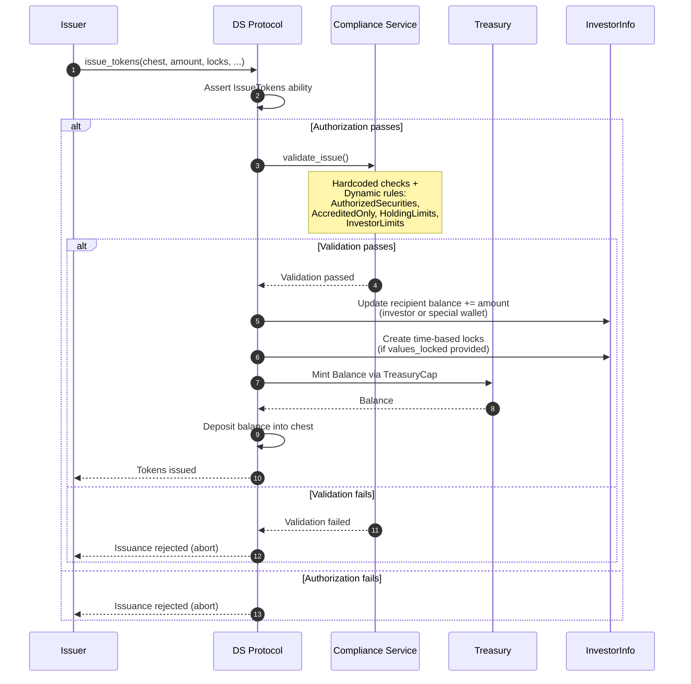

# Issue Flow

## Overview

The issue flow mints new tokens and deposits them into an investor's or special wallet's chest. Unlike transfer/burn/seize, the issue flow does **not** use PAS requests. Tokens are minted directly via `TreasuryCap::mint_balance` and deposited into the recipient's chest.

Enforced via capability-based authorization (`IssueTokens` ability).

## Function Signatures

### `issue_tokens` (recipient has an existing chest)

```move
public fun issue_tokens<T>(
    treasury: &mut Treasury<T>,
    auth: &Auth<T>,
    investors: &mut InvestorInfo<T>,
    compliance_config: &mut ComplianceConfig<T>,
    to: &Chest,
    to_address: address,
    value: u64,
    reason_code: u64,
    reason_string: String,
    version: &Version,
    values_locked: vector<u64>,
    release_times: vector<u64>,
    issuance_time_ms: u64,
    clock: &Clock,
    ctx: &mut TxContext,
)
```

### `issue_tokens_no_chest` (pre-chest issuance)

```move
public fun issue_tokens_no_chest<T>(
    treasury: &mut Treasury<T>,
    auth: &Auth<T>,
    investors: &mut InvestorInfo<T>,
    compliance_config: &mut ComplianceConfig<T>,
    namespace: &Namespace,
    to: address,
    value: u64,
    reason_code: u64,
    reason_string: String,
    version: &Version,
    values_locked: vector<u64>,
    release_times: vector<u64>,
    issuance_time_ms: u64,
    clock: &Clock,
    ctx: &mut TxContext,
)
```

### Difference

| Aspect | `issue_tokens` | `issue_tokens_no_chest` |
|---|---|---|
| Recipient param | `to: &Chest` + `to_address: address` | `namespace: &Namespace` + `to: address` |
| Chest ownership | `assert!(to.owner() == to_address)` | No chest ownership check |
| Balance delivery | `to.deposit_balance(balance)` | `balance.send_funds(namespace.chest_address(to))` |
| Use case | Investor already has a Chest on-chain | Used during investor registration before Chest creation |

Both delegate to the same internal function for validation and balance tracking.

## Execution Steps

1. **Version check** - `version.check_is_valid()`
2. **Authorization check** - caller must have `IssueTokens` ability (roles: `Master`, `Issuer`)
3. **Chest ownership check** (only `issue_tokens`) - `assert!(to.owner() == to_address)`
4. **Read total supply** - from `TreasuryCap<T>` stored on Treasury
5. **Input validation** - `assert!(value > 0)` and `assert!(values_locked.length() == release_times.length())`
6. **Compliance validation** - `compliance_service::validate_issue(...)` (see below)
7. **Update recipient balances**:
   - **Regular investor wallet**: adds `value` to investor total + per-wallet balance (u256 safe arithmetic)
   - **Special wallet**: adds `value` to special wallet balance (u256 safe arithmetic)
8. **Create locks** (regular wallets only) - iterates over `values_locked`/`release_times` to create time-based locks via `lock_manager::add_lock_internal`. Asserts `total_locked <= value`.
9. **Emit events** - `Issue<T>` and `Transfer<T>` (from `@0x0`)
10. **Mint tokens** - `treasury_cap.mint_balance(value)` creates new `Balance<T>`
11. **Deposit** - balance sent to recipient's chest

## Compliance Validation (`validate_issue`)

### Hardcoded Checks

1. Recipient must be a registered wallet or special wallet (`ENotWhitelisted`)
2. Recipient region must not be `FORBIDDEN` (`EDestinationRestricted`)
3. Resolve effective issuance timestamp via `BackdatingIssuance` config (if backdating disallowed, uses current time)
4. **Issuance to special wallet** - early return, only checks `AuthorizedSecurities` if registered
5. Recipient must not be in liquidate-only mode (`EInvestorLiquidateOnly`)

### Dynamic Rules (iterated from registered rules)

| Rule | What it checks |
|---|---|
| `AuthorizedSecurities` | `total_supply + amount <= max_supply` (0 = unlimited) |
| `AccreditedOnly` | Recipient must be accredited (globally or US-only depending on config) |
| `HoldingLimits` | Recipient post-issuance balance must be within min/max holding limits (global and per-region) |
| `InvestorLimits` | Only for new investors (balance was 0). Checks total, US, US accredited, non-accredited, JP, EU retail count caps |

### Record Issuance

After validation passes:
- Increments total investor count if recipient is a new investor
- Pushes issuance record (`amount` + `timestamp`) onto investor's issuance history (for lockup tracking)
- Cleans up expired issuance records based on `LockupRestriction` lock period
- Emits `DSComplianceIssuanceRecorded<T> { to, amount }`

## Events

| Event | Fields |
|---|---|
| `DSComplianceIssuanceRecorded<T>` | `to`, `amount` |
| `Issue<T>` | `to`, `value`, `value_locked` |
| `Transfer<T>` | `from: @0x0`, `to`, `value` |
| `HolderLocked<T>` (per lock) | emitted for each individual lock created |

## Full PTB Call Sequence

```
1. ds_token::issue_tokens(treasury, auth, investors, compliance_config, chest, to_address, value, ...)
      -> compliance check + balance updates + lock creation + events + mint + deposit
```

Or for pre-chest issuance:

```
1. ds_token::issue_tokens_no_chest(treasury, auth, investors, compliance_config, namespace, to, value, ...)
      -> compliance check + balance updates + lock creation + events + mint + send to derived chest address
```

## Sequence Diagram


