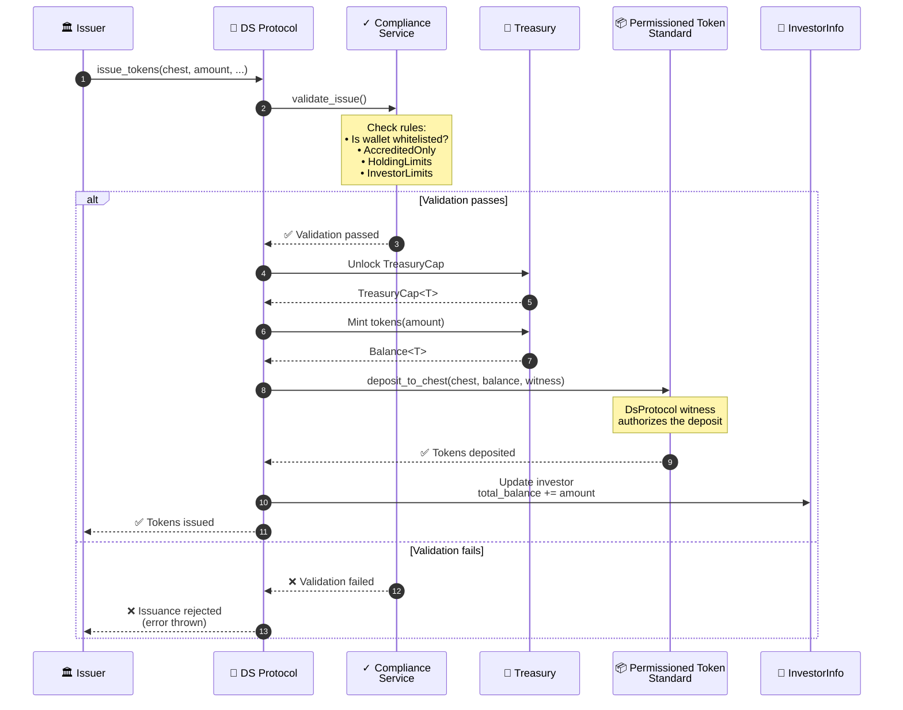

# Issue Tokens Sequence Diagram

```mermaid
sequenceDiagram
    autonumber
    participant Issuer as 🏛️ Issuer
    participant DS as 🔷 DS Protocol
    participant Compliance as ✓ Compliance<br/>Service
    participant Treasury as 🏦 Treasury
    participant PTS as 📦 Permissioned Token<br/>Standard
    participant Registry as 👥 InvestorInfo

    Issuer->>DS: issue_tokens(chest, amount, ...)

    DS->>Compliance: validate_issue()

    Note over Compliance: Check rules:<br/>• Is wallet whitelisted?<br/>• AccreditedOnly<br/>• HoldingLimits<br/>• InvestorLimits

    alt Validation passes
        Compliance-->>DS: ✅ Validation passed

        DS->>Treasury: Unlock TreasuryCap
        Treasury-->>DS: TreasuryCap<T>

        DS->>Treasury: Mint tokens(amount)
        Treasury-->>DS: Balance<T>

        DS->>PTS: deposit_to_chest(chest, balance, witness)
        Note over PTS: DsProtocol witness<br/>authorizes the deposit
        PTS-->>DS: ✅ Tokens deposited

        DS->>Registry: Update investor<br/>total_balance += amount

        DS-->>Issuer: ✅ Tokens issued
    else Validation fails
        Compliance-->>DS: ❌ Validation failed
        DS-->>Issuer: ❌ Issuance rejected<br/>(error thrown)
    end
```
