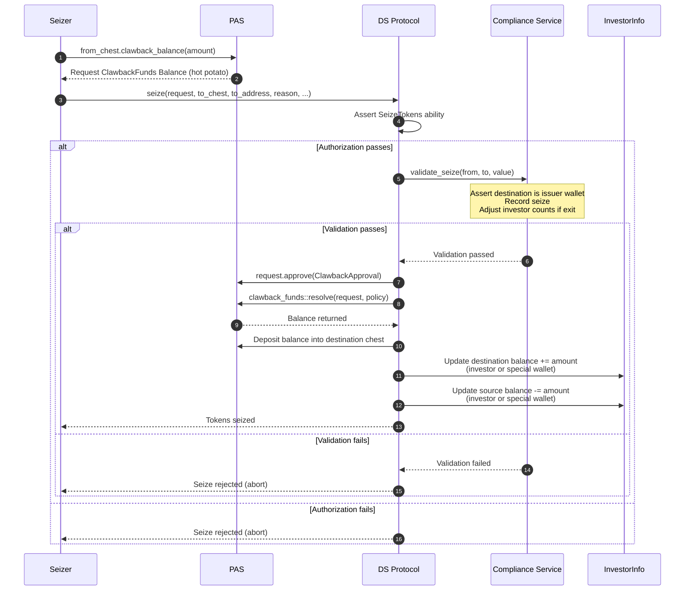

# Seize Flow

## Overview

The seize flow forcibly transfers tokens from one wallet to an issuer wallet. It uses a PAS `Request<ClawbackFunds<Balance<T>>>` that is created externally, then approved and resolved **internally** within `ds_token::seize`. The extracted balance is deposited into the destination chest.

Enforced via capability-based authorization (`SeizeTokens` ability). Destination must be an issuer wallet.

## Function Signature

```move
public fun seize<T>(
    auth: &Auth<T>,
    investors: &mut InvestorInfo<T>,
    policy: &Policy<Balance<T>>,
    mut request: Request<ClawbackFunds<Balance<T>>>,
    to: &Chest,
    to_address: address,
    reason: String,
    version: &Version,
    ctx: &mut TxContext,
)
```

## PAS Request/Approval Pattern

1. **Create** - `from_chest.clawback_balance(amount, ctx)` withdraws `Balance<T>` from the source chest and wraps it into a `Request<ClawbackFunds<Balance<T>>>` with an empty approvals set. No `Auth` proof required (admin action).
2. **Approve** - Inside `ds_token::seize`, the request is stamped: `request.approve(ClawbackApproval<T>())`.
3. **Resolve** - Also inside `ds_token::seize`, the request is resolved: `clawback_funds::resolve(request, policy)` verifies the collected approvals match the `Policy<Balance<T>>` requirements and returns the `Balance<T>`, which is then deposited into the destination chest.

## Execution Steps

1. **Version check** - `version.check_is_valid()`
2. **Extract request data** - source owner address and amount from `request.data()`
3. **Authorization check** - caller must have `SeizeTokens` ability (roles: `Master`, `TransferAgent`)
4. **Destination chest ownership** - `assert!(to.owner() == to_address)`
5. **Compliance validation** - `compliance_service::validate_seize(investors, from_address, to_address, value)` (see below)
6. **Approve request** - `request.approve(ClawbackApproval<T>())`
7. **Resolve request** - `clawback_funds::resolve(request, policy)` returns `Balance<T>`
8. **Deposit to destination** - `to.deposit_balance(balance)` into the destination chest
9. **Update destination balances**:
   - **Regular investor wallet**: adds `value` to investor total + per-wallet balance (u256 safe arithmetic)
   - **Special wallet**: adds `value` to special wallet balance (u256 safe arithmetic)
10. **Update source balances**:
    - **Regular investor wallet**: subtracts `value` from investor total + per-wallet balance
    - **Special wallet**: subtracts `value` from special wallet balance
11. **Emit events** - `Seize<T>` and `Transfer<T>`

## Compliance Validation (`validate_seize`)

- Destination must be an issuer wallet (`ENotIssuerWallet`)
- Resolves `PartyInfo` for the source address
- If the seizure causes the source investor to exit (`total_balance == amount`), decrements total investor counts (and adjusts country/accreditation breakdowns)
- Emits `DSComplianceSeizeRecorded<T> { from, amount }`

No dynamic compliance rules are checked for seize.

## Events

| Event | Fields |
|---|---|
| `DSComplianceSeizeRecorded<T>` | `from`, `amount` |
| `Seize<T>` | `from`, `to`, `value`, `reason` |
| `Transfer<T>` | `from`, `to`, `value` |

## Full PTB Call Sequence

```
1. from_chest.clawback_balance(amount, ctx)
      -> Request<ClawbackFunds<Balance<T>>>

2. ds_token::seize(auth, investors, policy, request, to_chest, to_address, reason, version, ctx)
      -> compliance check + approve + resolve + deposit + balance updates
```

## Sequence Diagram


