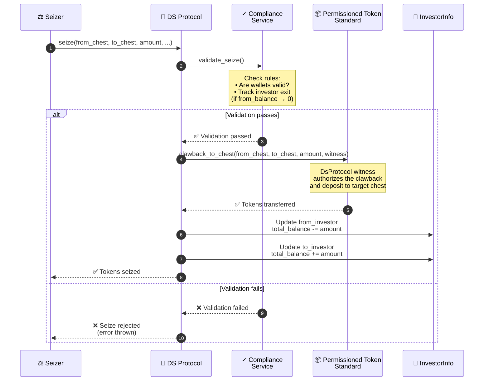

# Seize Tokens Sequence Diagram

```mermaid
sequenceDiagram
    autonumber
    participant Seizer as ⚖️ Seizer
    participant DS as 🔷 DS Protocol
    participant Compliance as ✓ Compliance<br/>Service
    participant PTS as 📦 Permissioned Token<br/>Standard
    participant Registry as 👥 InvestorInfo

    Seizer->>DS: seize(from_chest, to_chest, amount, ...)

    DS->>Compliance: validate_seize()

    Note over Compliance: Check rules:<br/>• Are wallets valid?<br/>• Track investor exit<br/>(if from_balance → 0)

    alt Validation passes
        Compliance-->>DS: ✅ Validation passed

        DS->>PTS: clawback_to_chest(from_chest, to_chest, amount, witness)
        Note over PTS: DsProtocol witness<br/>authorizes the clawback<br/>and deposit to target chest
        PTS-->>DS: ✅ Tokens transferred

        DS->>Registry: Update from_investor<br/>total_balance -= amount
        DS->>Registry: Update to_investor<br/>total_balance += amount

        DS-->>Seizer: ✅ Tokens seized
    else Validation fails
        Compliance-->>DS: ❌ Validation failed
        DS-->>Seizer: ❌ Seize rejected<br/>(error thrown)
    end
```
