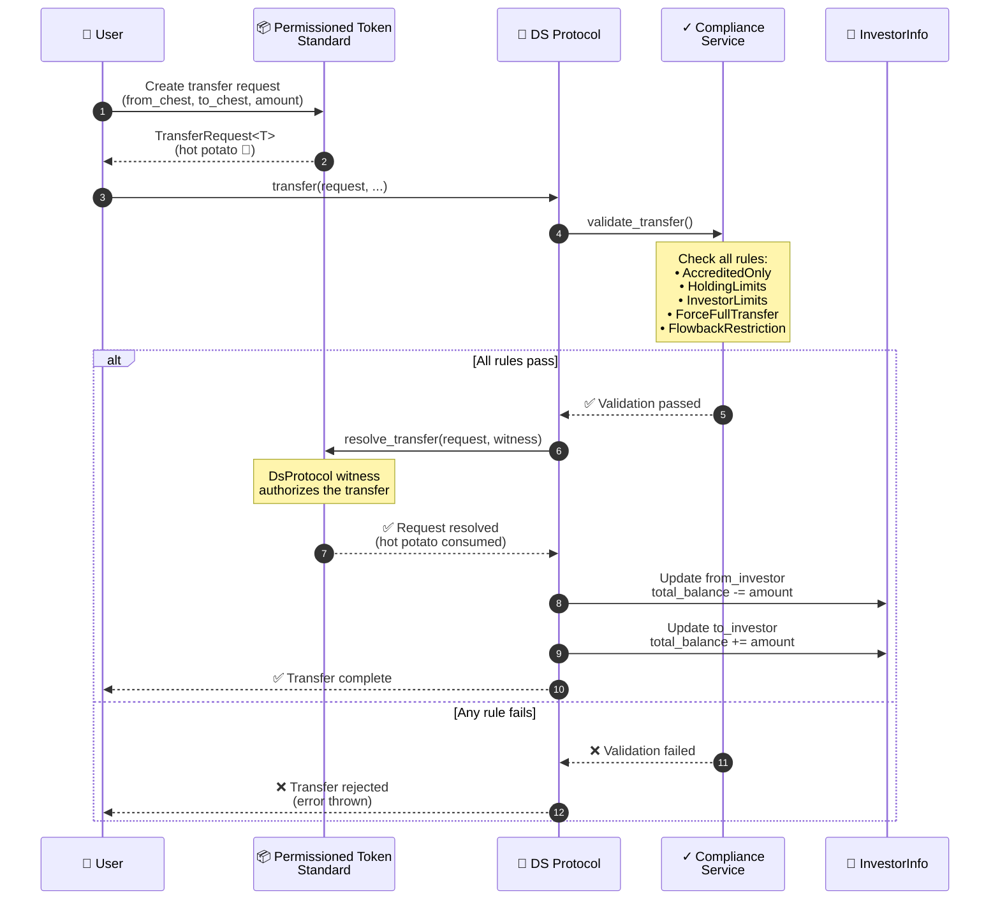

# Token Transfer Sequence Diagram

```mermaid
sequenceDiagram
    autonumber
    participant User as 👤 User
    participant PTS as 📦 Permissioned Token<br/>Standard
    participant DS as 🔷 DS Protocol
    participant Compliance as ✓ Compliance<br/>Service
    participant Registry as 👥 InvestorInfo

    User->>PTS: Create transfer request<br/>(from_chest, to_chest, amount)
    PTS-->>User: TransferRequest<T><br/>(hot potato 🥔)

    User->>DS: transfer(request, ...)

    DS->>Compliance: validate_transfer()

    Note over Compliance: Check all rules:<br/>• AccreditedOnly<br/>• HoldingLimits<br/>• InvestorLimits<br/>• ForceFullTransfer<br/>• FlowbackRestriction

    alt All rules pass
        Compliance-->>DS: ✅ Validation passed

        DS->>PTS: resolve_transfer(request, witness)
        Note over PTS: DsProtocol witness<br/>authorizes the transfer
        PTS-->>DS: ✅ Request resolved<br/>(hot potato consumed)

        DS->>Registry: Update from_investor<br/>total_balance -= amount
        DS->>Registry: Update to_investor<br/>total_balance += amount

        DS-->>User: ✅ Transfer complete
    else Any rule fails
        Compliance-->>DS: ❌ Validation failed
        DS-->>User: ❌ Transfer rejected<br/>(error thrown)
    end
```