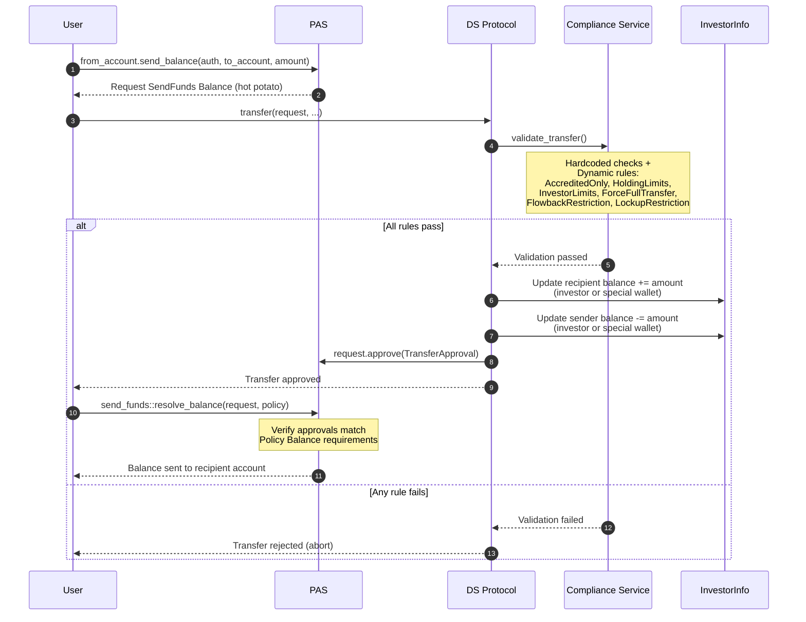

# Transfer Flow

## Overview

The transfer flow moves tokens between two accounts (wallets) and is the most compliance-intensive operation. It uses a PAS `Request<SendFunds<Balance<T>>>` that must be created, approved, and resolved within a single PTB.

No transfer can bypass `compliance_service::validate_transfer`.

## Function Signature

```move
public fun transfer<T>(
    treasury: &Treasury<T>,
    investors: &mut InvestorInfo<T>,
    compliance_config: &ComplianceConfig<T>,
    request: &mut Request<SendFunds<Balance<T>>>,
    version: &Version,
    clock: &Clock,
)
```

## PAS Request/Approval Pattern

1. **Create** - `from_account.send_balance(auth, to_account, amount, ctx)` withdraws `Balance<T>` from the sender's account and wraps it into a `Request<SendFunds<Balance<T>>>` with an empty approvals set. Requires the sender's `Auth` proof.
2. **Approve** - Inside `ds_token::transfer`, after all compliance checks pass, the request is stamped: `request.approve(TransferApproval<T>())`.
3. **Resolve** - The caller must call `send_funds::resolve_balance(request, policy)` as a separate move call in the same PTB. This verifies the collected approvals match the `Policy<Balance<T>>` requirements (configured during setup to require `TransferApproval<T>`), then sends the `Balance<T>` to the recipient's account.

An unresolved request aborts the transaction (hot potato).

## Execution Steps

1. **Version check** - `version.check_is_valid()`
2. **Extract request data** - sender address, recipient address, and amount from `request.data()`
3. **Non-zero assertion** - `assert!(value > 0, EValueZero)`
4. **Pause guard** - Only investor-to-investor transfers are blocked when `treasury.is_paused()`. Transfers involving special wallets are still permitted.
5. **Compliance validation** - `compliance_service::validate_transfer(...)` (see below)
6. **Update recipient balances** - Adds `value` to the recipient's investor total + per-wallet balance (regular wallet) or special wallet balance. Uses u256 arithmetic with safe conversion via `try_from_u256_to_u64!` for overflow protection.
7. **Update sender balances** - Subtracts `value` from the sender's investor total + per-wallet balance (regular wallet) or special wallet balance. Asserts sufficient balance.
8. **Approve request** - `request.approve(TransferApproval<T>())`
9. **Emit events** - `Transfer<T> { from, to, value }`

## Compliance Validation (`validate_transfer`)

### Hardcoded Checks

1. Recipient must be a registered wallet or special wallet (`ENotWhitelisted`)
2. **Transfer to special wallet** - early return, only checks `ForceFullTransfer` if registered
3. **Same investor transfer** (between own wallets) - early return, skips all compliance
4. Recipient region must not be `FORBIDDEN` (`EDestinationRestricted`)
5. Sender lock constraints: full lock + individual time-based locks via `lock_manager::compute_transferable` (`ETokensLocked`)
6. Recipient must not be in liquidate-only mode (`EInvestorLiquidateOnly`)

### Dynamic Rules (iterated from registered rules)

| Rule | What it checks |
|---|---|
| `AccreditedOnly` | Recipient must be accredited (globally or US-only depending on config) |
| `HoldingLimits` | Sender remaining balance and recipient new balance must be within min/max holding limits (global and per-region) |
| `InvestorLimits` | Investor count caps: total, US, US accredited, non-accredited, JP, EU retail. Checks new/exiting investor impact |
| `ForceFullTransfer` | Sender must transfer entire balance (globally or US-only). Special wallet senders exempt |
| `FlowbackRestriction` | Blocks non-US to US transfers during a configurable restriction period |
| `LockupRestriction` | Tokens from recent issuances are locked for a configurable period (US vs non-US). Transfer amount must not exceed unlocked balance |

### Record Transfer

After validation passes:
- Increments total investor count if recipient is a new investor (`total_balance == 0`)
- Decrements total investor count if sender is exiting (`total_balance == amount`) and sender and recipient are different investors
- Cleans up expired issuances for both parties
- Emits `DSComplianceTransferRecorded<T> { from, to, amount }`

## Events

| Event | Fields |
|---|---|
| `DSComplianceTransferRecorded<T>` | `from`, `to`, `amount` |
| `Transfer<T>` | `from`, `to`, `value` |

## Full PTB Call Sequence

```
1. from_account.send_balance(auth, to_account, amount, ctx)
      -> Request<SendFunds<Balance<T>>>

2. ds_token::transfer(treasury, investors, compliance_config, &mut request, version, clock)
      -> compliance checks + balance updates + TransferApproval<T> stamp

3. send_funds::resolve_balance(request, policy)
      -> verify approvals, send Balance<T> to recipient account
```

## Sequence Diagram


